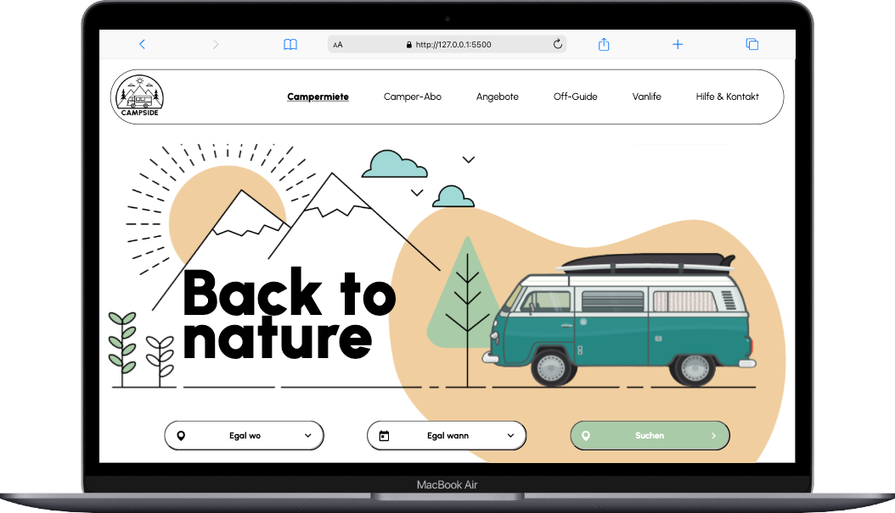
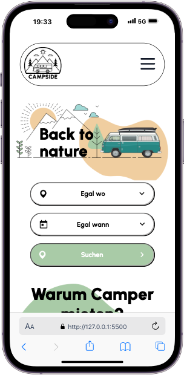
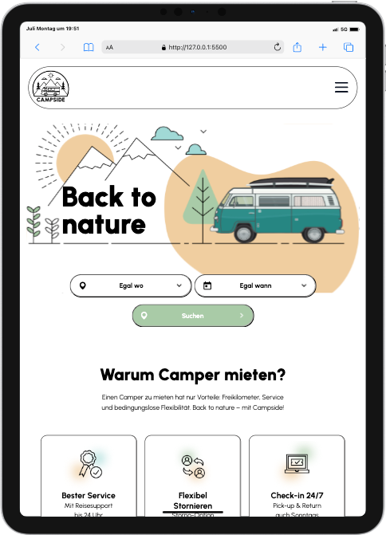

# Project Back to Nature

Back to Nature ist ein Einzelprojekt aus Modul1 des WebDev Kurses mit einem vorgegebenen Design in Figma.

Zeit zur Umsetzung: ca. 12 Stunden

## Über das Projekt

Das Projekt ist ausschließlich in HTML und CSS gebaut, enthält also keine funktionellen Elemente, oder Scripte.

Dateien sind erstellt nach dem mobile first Prinzip.

Ich habe mich bei der Umsetzung für SASS entschieden.
Dies hat jedoch auch einige Schwierigkeiten mit sich gebracht, da es erst das zweite Mal überhaupt
und das erste größere Projekt ist, bei dem ich SASS verwendet habe.

Das Einbinden der Media Queries war dem zu Folge auch etwas mühlesiger als sonst.

Die Responsivität beim reinen vergößern des Browserfensters gefällt mir gar nicht.

In den jeweiligen Bildschirmgrößen - ohne Zwischenschritte - sieht es aber gut aus.

 - iPhone 14 PRO

 - iPad PRO 11

### Fazit

Joa, kann man besser machen, aber heute nicht mehr :)
